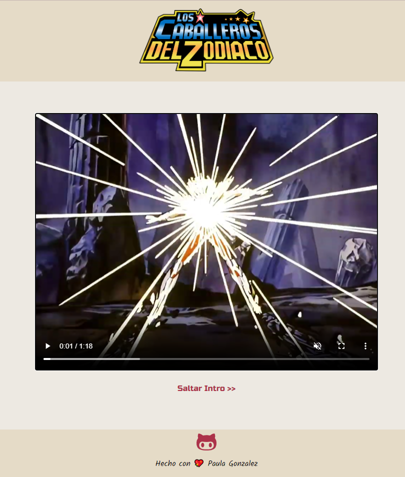
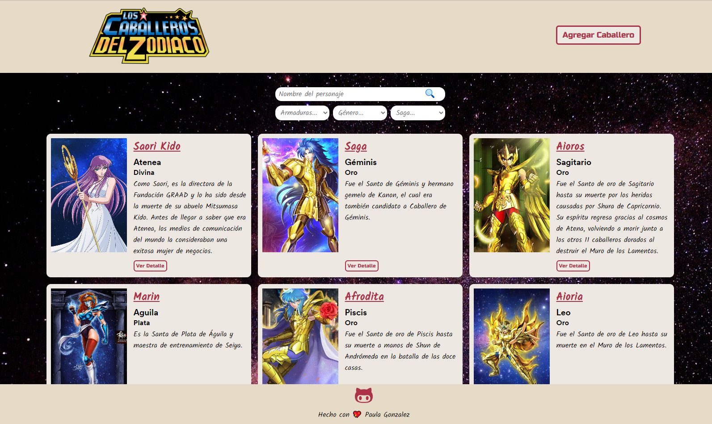
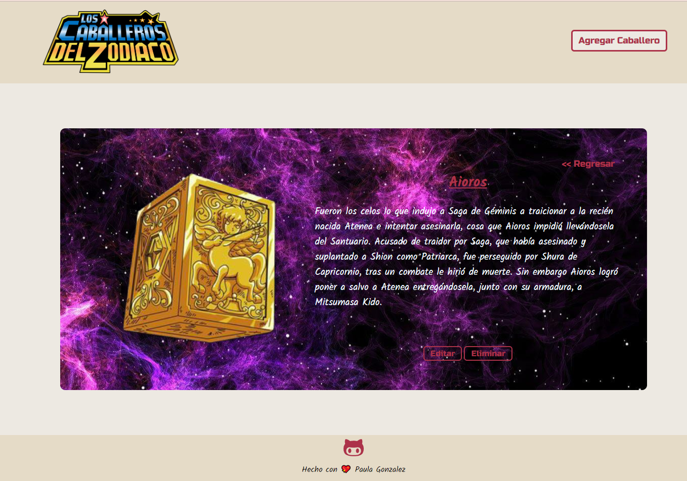

# CRUD

Este es mi primer proyecto CRUD (Create, Read, Update, Delete), en donde creé la Api (MockApi.io) de los Caballeros del Zoodiaco.
Está hecho con HTML y Sass y es totalmente responsive.

Este proyecto cuenta con una Intro la cual da comienzo a la página después de su reproducción o a través del botón saltar intro.

En ésta se puede agregar, editar, y borrar caballeros.

Cuenta con filtros y un buscador por nombre.

Tiene los detalles de cada cabellero, en donde se podrá editarlo o borrarlo.

Espero sea de su agrado, lo hice con mucho amor y entusiasmo, gracias por llegar hasta aca.
